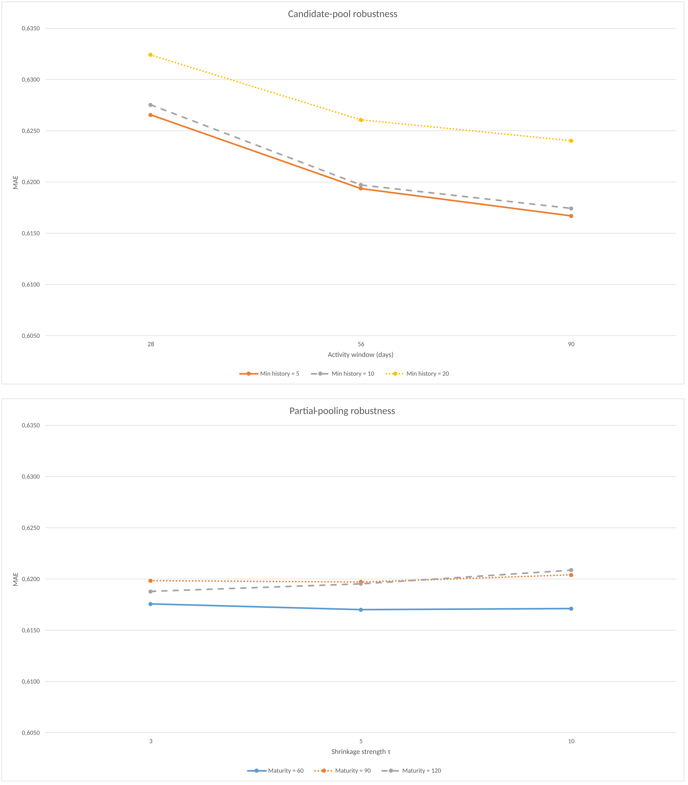
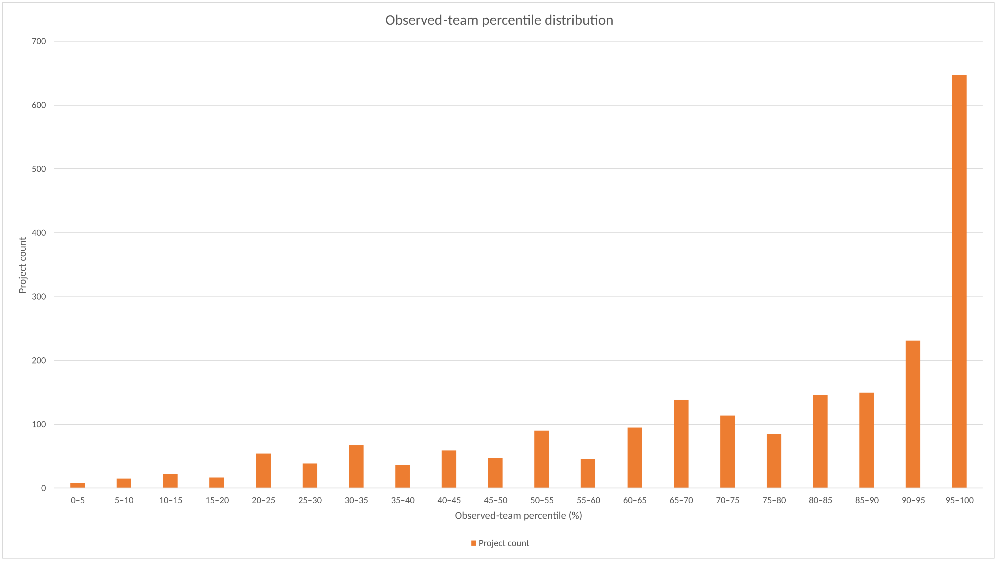

# Gryzzly Team Composition — Final Reproducibility Repository

Reproducibility package synchronized to the final audited manuscript:

**“Intensive Cooperative Game for Project Team Composition from Digital Traces”**  
Russian title: **«Интенсивная кооперативная игра для формирования состава проектных команд по цифровым следам»**.

The repository implements a leakage-aware, point-in-time reconstruction of candidate histories from longitudinal Gryzzly digital traces, evaluates predictive specifications with rolling-origin validation, performs strict sensitivity checks, analyzes fixed-cardinality team composition, and verifies Shapley attribution for the composition term.



## Final study scope

The final manuscript uses a primary candidate-history setting of **56-day activity window / 10 prior declarations / 90-day outcome maturity / partial-pooling τ = 5**. Point-in-time reconstruction plus retrospective representability yields **2,682 projects, 157 source-schema workspaces, 36,174 project–candidate rows and 2,025 candidates**. The rolling-origin out-of-fold evaluation covers **2,107 projects**.

The final parsimonious specification reports:

- MAE: **0.6197**
- RMSE: **0.8241**
- R²: **0.268**

The package also freezes the strict no-size/no-planned-duration sensitivity, training-label embargo checks, corrected tie-aware formation analysis, and Table 2 composition-ablation results.

## What is included

```text
.
├── scripts/                 # original analytical pipeline + audit scripts
├── data/                    # input manifest and local-data instructions
├── results_reference/       # frozen final reference outputs
├── docs/                    # original reproduction/audit documentation
├── paper/                   # final submission metadata, figures, provenance
├── requirements.txt         # verified environment dependencies
├── PYTHON_VERIFIED.txt
└── SHA256SUMS.txt
```

## Reproduction

After placing the required Gryzzly source files in `data/`:

```bash
python -m venv .venv
# Windows: .venv\Scripts\activate
# macOS/Linux: source .venv/bin/activate
pip install -r requirements.txt

python scripts/run_all.py --stage core
python scripts/run_all.py --stage stageg
python scripts/run_all.py --stage audit
python scripts/validate_results.py
```

The verified archived environment is Python 3.13.5, NumPy 2.3.5, pandas 2.2.3 and scikit-learn 1.8.0.

## Methodological boundaries

This is an observational research pipeline. The project outcome is a plan–realization labor-ratio outcome, **not productivity or overall project success**. Candidate historical profiles are historical exposure measures, not stable competence scores. Model-score gaps are not realized counterfactual gains. Team size, roles, capacity, availability, fairness and privacy constraints remain external to the fixed-cardinality composition ranking.

## Final formation-analysis checkpoint

The corrected final procedure enumerates all feasible same-size coalitions when `C(N,k) <= 2000`; otherwise it samples 2,000 deterministic project-seeded coalitions. Exact optimal matching is tie-aware.

Final checkpoints include:

- observed team above random same-size expectation: **77.27%**;
- median observed-team percentile: **83.33rd**;
- tie-aware coincidence with at least one model-optimal composition: **14.57%**.



## Manuscript status

The full manuscript is intentionally not duplicated in this repository. Final portal-ready metadata and numerical provenance are preserved in `paper/`.

## License

No repository-level software license is granted by default.
